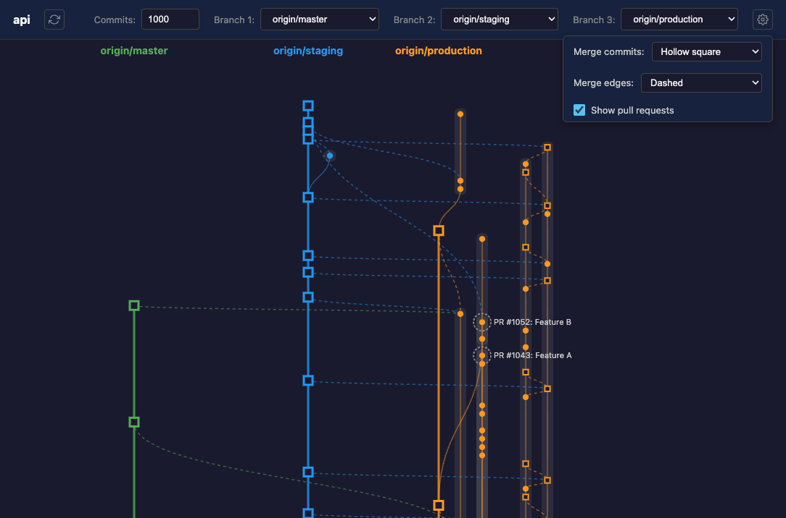

# gitopo

Topology-preserving Git commit graph visualizer that highlights key branches.

## Overview

gitopo visualizes Git commit history with special treatment for mainline branches following Git Flow, GitHub Flow, and GitLab Flow conventions. It displays commits in columns based on their branch lineage, making it easy to understand the relationship between branches.

Built with Electron, Vite, and D3.js.



## Features

- **Key Branch Columns**: Up to 3 main branches displayed in dedicated columns with distinct colors
- **Sub-branch Detection**: Automatically detects and groups commits that belong to feature branches
- **Pull Request Display**: Shows open PRs from GitHub (requires `gh` CLI)
- **Time Axis Zoom**: Ctrl/Cmd + scroll to zoom in/out on the time axis
- **Pan Navigation**: Scroll or drag to navigate the graph
- **Configurable Commit Limit**: Adjust the number of commits to display (1 to 100,000,000)
- **Loading Screen**: Shows progress during initialization
- **Responsive UI**: Controls adapt to window width

## Installation

```bash
npx gitopo
```

Or install globally:

```bash
npm install -g gitopo
```

## Usage

Run in any Git repository:

```bash
cd your-project
npx gitopo
```

The application launches in the background. Close the window to exit.

### Controls

| Action | Description |
|--------|-------------|
| Scroll | Pan the graph |
| Drag | Pan the graph |
| Ctrl/Cmd + Scroll | Zoom time axis |
| Hover on commit | Show commit details tooltip |
| Hover on Other commit | Highlight connecting edges to key branches |

### UI Elements

- **Branch Selectors (1-3)**: Choose which branches to display as key columns
- **Commits Input**: Set the maximum number of commits to load
- **Column Headers**: Branch names displayed at the top (follows horizontal scroll)

## Configuration

Add a `gitopo` key to your project's `package.json`:

```json
{
  "gitopo": {
    "keyBranches": ["origin/main", "origin/staging", "origin/production"]
  }
}
```

### Options

| Option | Type | Description |
|--------|------|-------------|
| `keyBranches` | `string[]` | Default branches for the 3 branch selectors (in order) |

If `keyBranches` is not specified, the first selector defaults to `main` or `master`.

## Requirements

- Node.js
- Git
- GitHub CLI (`gh`) - optional, for PR display

## Development

```bash
# Install dependencies
npm install

# Start Vite dev server
npm run dev

# In another terminal, start Electron in dev mode
npm run electron:dev

# Build for production
npm run build

# Run production build
npx gitopo
```

## License

MIT
